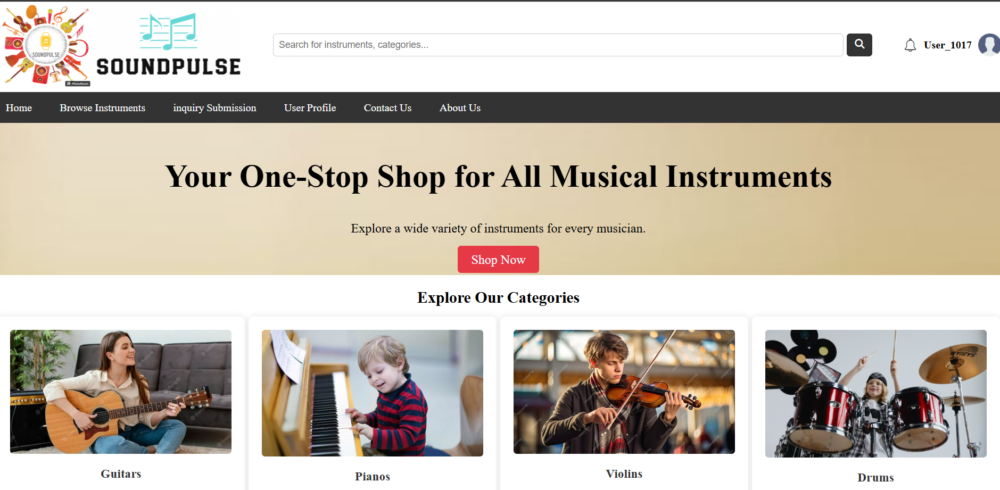
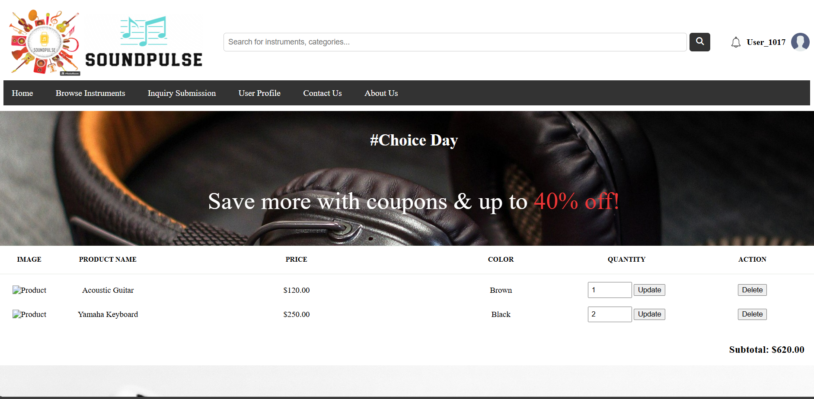
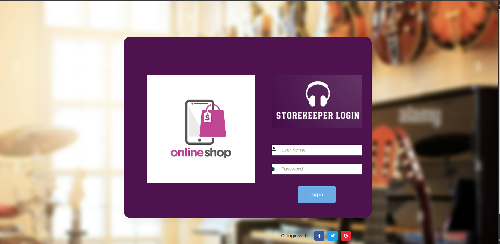
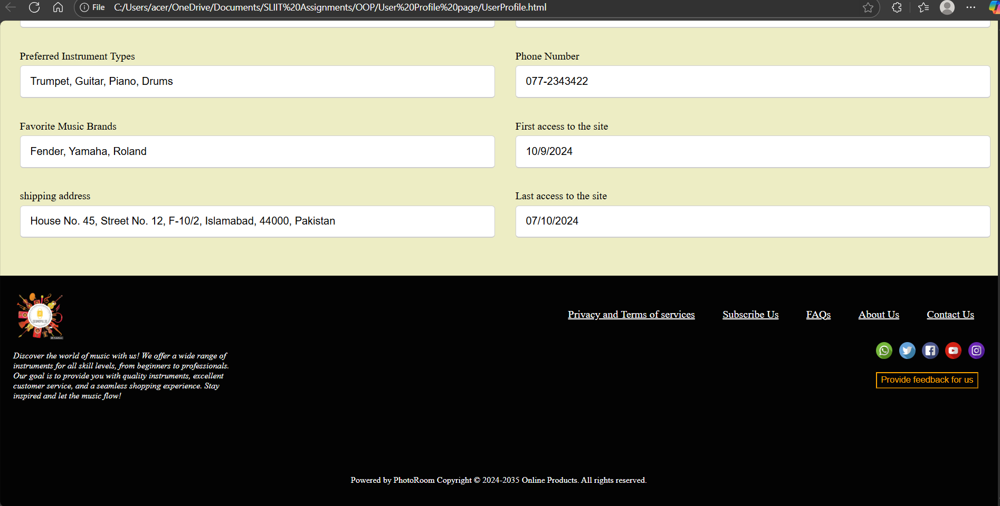
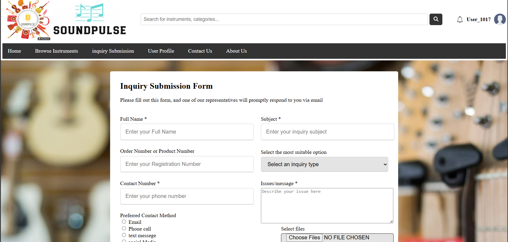
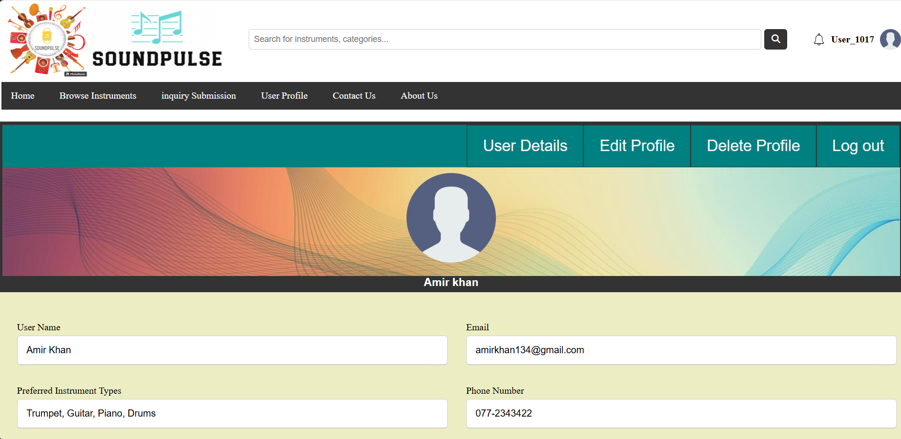
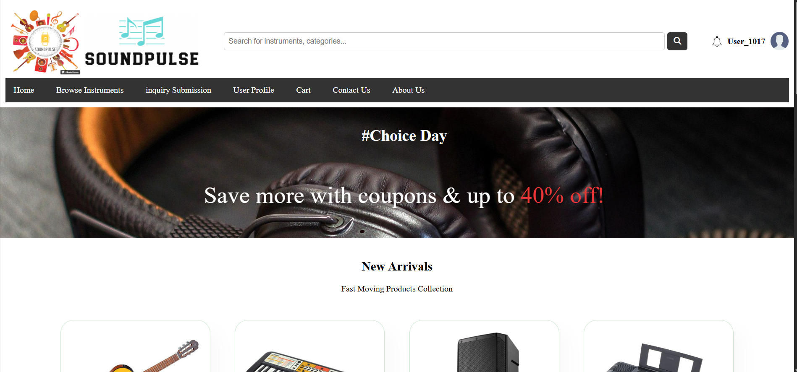
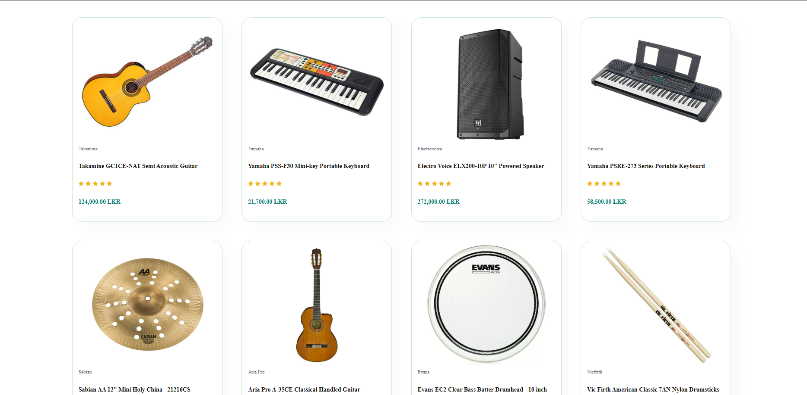

# 🎵 Online Music Store — Java Servlet Project

An interactive web-based music store built using Java Servlets, HTML, CSS, and JDBC. This application allows users to browse, search, and purchase music albums while storekeepers manage inventory and user profiles.

---

## 📸 Project Preview

---

## 🚀 Features

- User Registration and Login
- Browse and Search Music Albums
- Add to Cart and Checkout
- Admin Panel for Storekeepers
- Profile Management
- Secure Session Handling

---

## 🛠️ Technologies Used

- **Java Servlet API**
- **JSP & HTML/CSS**
- **JDBC with MySQL**
- **Bootstrap (for UI styling)**
- **Tomcat Server**

---

